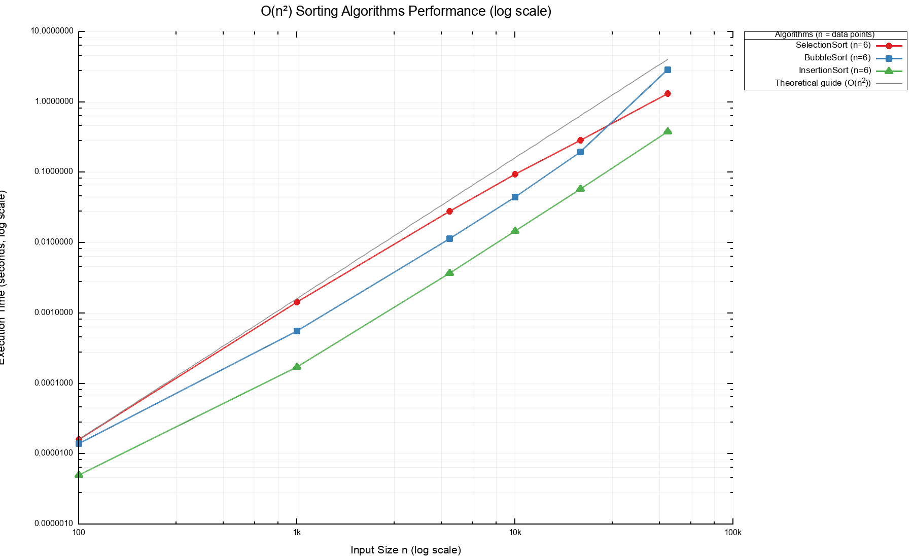
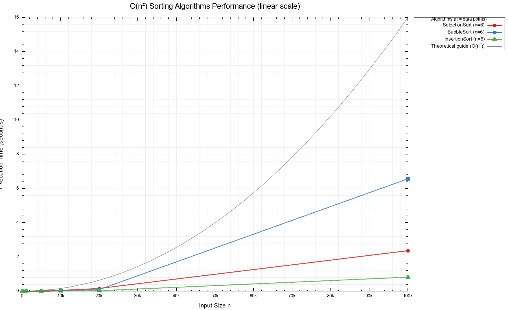
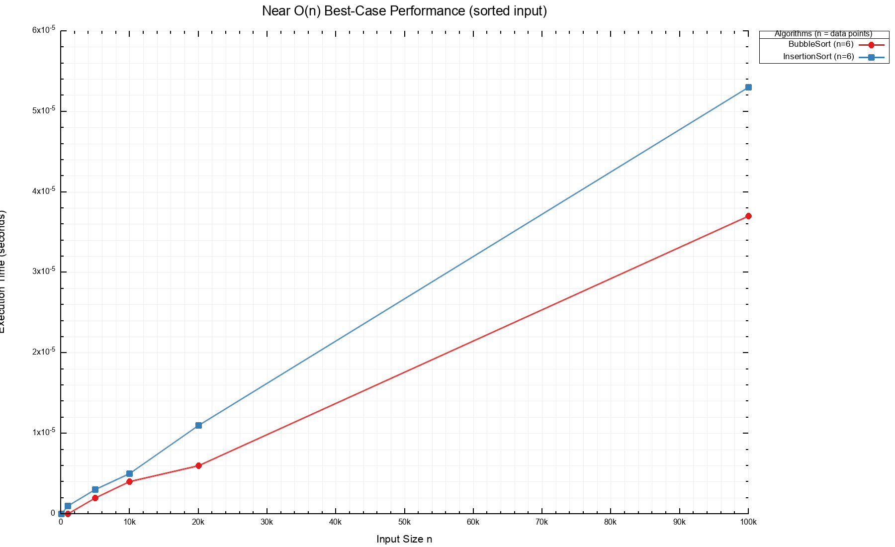
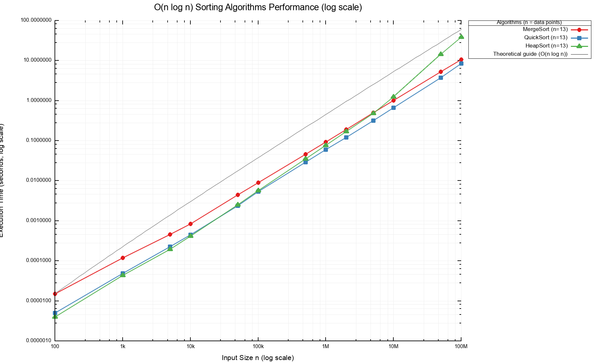
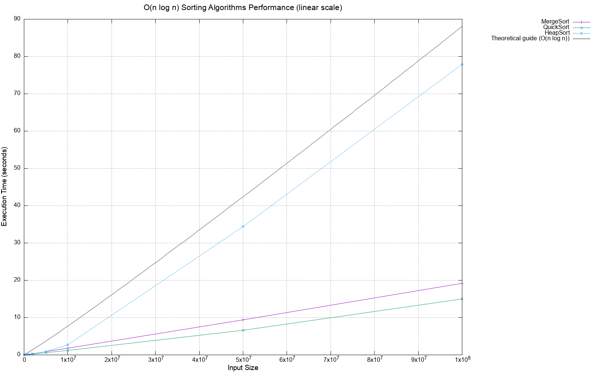
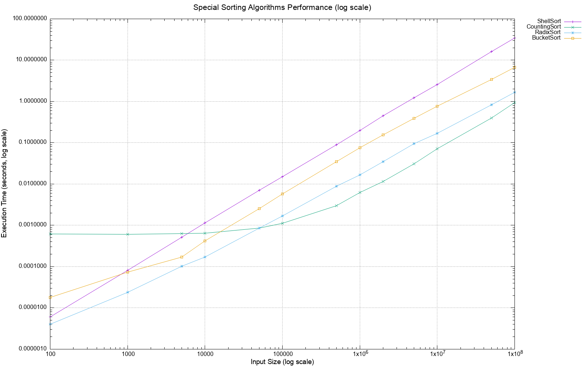
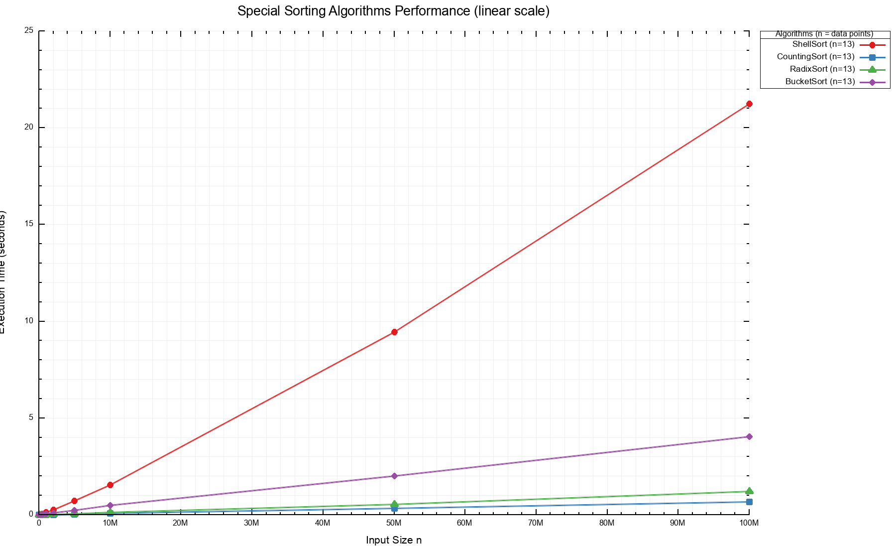
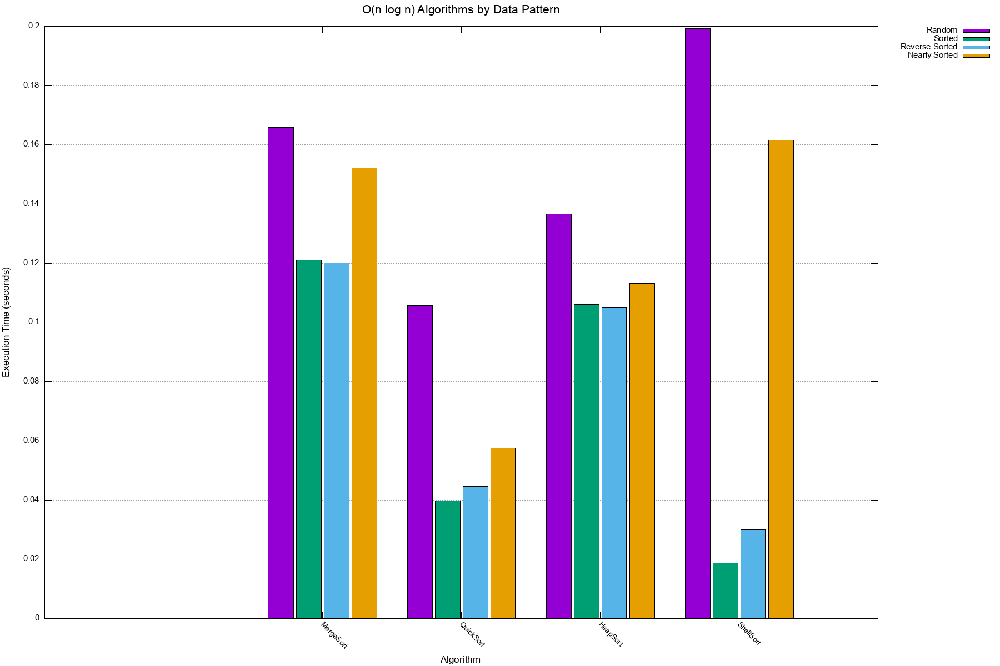
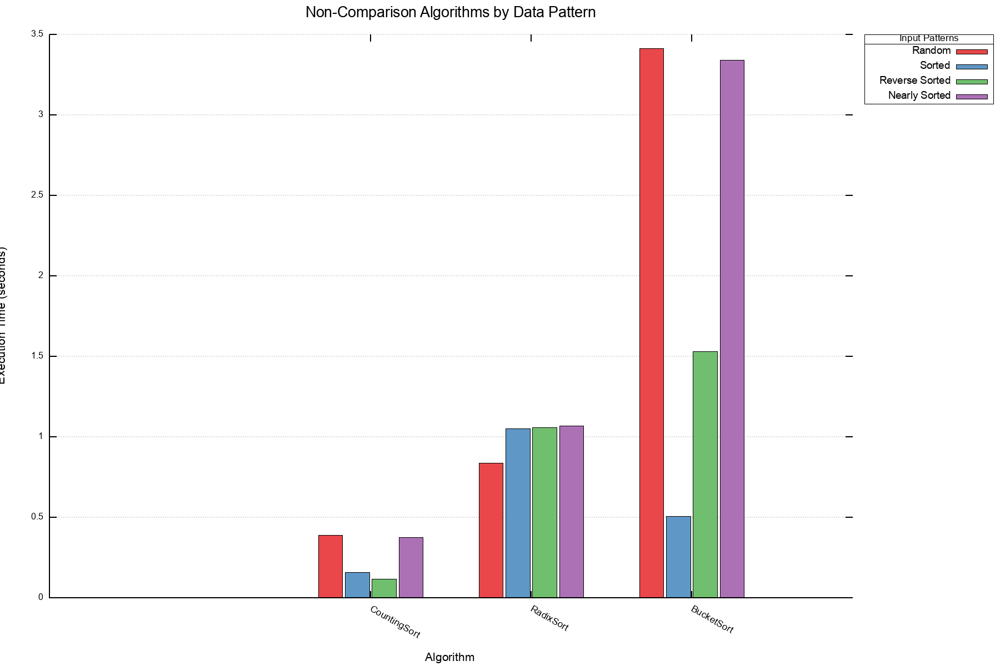

# Sorting Algorithm Performance Benchmark Report

## 1. Goals

- Implement a C version of 10 sorting algorithms
- Benchmark them under controlled conditions (same machine, same generator, same timing API).
- Visualize how time complexity behaves in practice:
  - $O(n^2)$ vs $O(n \log n)$ vs $O(n)$ non-comparison sorts.
  - Sensitivity to input order: random / already sorted / reverse sorted / nearly sorted.
- Verify correctness: all algorithms must produce identical sorted output for the same input.

## 2. Algorithms & Input Models

### 2.1 Algorithms Implemented

All algorithms share the same `void sort(int *arr, int n)`-style API behind `sorts.h`, and are selected by name in the benchmark.

* Quadratic comparison sorts ($O(n^2)$ in the general case)
  * Selection sort (`selection.c`)
  * Bubble sort (`bubble.c`)
  * Insertion sort (`insertion.c`)

* Efficient comparison sorts ($O(n \log n)$ on average / worst)
  * Merge sort (`merge.c`)
  * Quick sort with random pivot (`quick.c`)
  * Heap sort (`heap.c`)
  * Shell sort with standard gap sequence ($n/2$) (`shell.c`)

* Special / non-comparison-based sorts (roughly linear in range/keys)
  * Counting sort (`counting.c`)
  * Radix sort (LSD, base 10) (`radix.c`)
  * Bucket sort with 10 buckets (`bucket.c`)

### 2.2 Input Sizes

Different size grids are used so that each complexity class is pushed to the regime where its behavior is visible.

* For quadratic algorithms (Selection, Bubble, Insertion)
  * `100, 1000, 5000, 10000, 20000, 50000`

* For efficient comparison algorithms (Merge, Quick, Heap, Shell)
  * `100, 1000, 5000, 10000, 50000, 100000, 500000, 1000000, 2000000, 5000000, 10000000, 50000000, 100000000`

* For linear/special algorithms (Counting, Radix, Bucket)
  * Same as efficient algorithms above.

### 2.3 Data Patterns

Four canonical patterns are used to expose best/worst/average behavior.

| Pattern | Description | Use Case |
|---------|-------------|----------|
| `Random` | Uniform random integers | Typical average-case workload |
| `Sorted` | Already sorted ascending | Best case for Bubble/Insertion |
| `ReverseSorted` | Perfectly descending | Worst case for naive Insertion/Bubble |
| `NearlySorted` | Sorted with 5% random swaps | Real-world nearly-sorted data |

### 2.4 Pattern Test Sizes (by Complexity Class)

Each complexity class uses optimized sizes for pattern comparison:

| Complexity Class | Pattern Test Size | Rationale |
|------------------|-------------------|-----------|
| $O(n^2)$ | 100,000 | Larger sizes take too long |
| $O(n \log n)$ | 5,000,000 | Balances runtime and visibility |
| $O(n)$ | 50,000,000 | Linear algorithms can handle large inputs |

### 2.5 Timing & Environment

* Timing uses `clock_gettime(CLOCK_MONOTONIC)` for nanosecond-precision wall-clock measurement.
* Each (algorithm, pattern, size) triple is run once.
* Large sizes (tens of millions) allocate hundreds of MB; ensure your machine has enough RAM.
* All results are verified for correctness using `qsort` as reference.
* Swap and comparison counts are tracked for detailed algorithmic analysis.

## 3. Benchmark Results

### 3.1 Key Findings Summary

#### $O(n^2)$ Algorithms (n = 100,000)

Time in seconds (s):

| Algorithm | Random | Sorted | Reverse Sorted | Nearly Sorted |
|-----------|--------|--------|----------------|---------------|
| Selection Sort | `2.38` | `1.70` | `2.13` | `1.69` |
| Bubble Sort | `6.69` | `0.00003` | `1.46` | `2.34` |
| Insertion Sort | `0.84` | `0.00004` | `1.66` | `0.10` |

**Key observations:**
- Bubble and Insertion sort achieve near-O(n) performance on sorted input (early-exit optimization).
- Selection sort has the same comparison count ($N(N-1)/2$) regardless of pattern, but execution times vary (`1.69`–`2.38`) due to differences in memory access patterns, branch prediction, and swap counts (0 swaps for sorted vs N/2 for reverse-sorted).
- Insertion sort is the fastest quadratic algorithm for random data.

#### $O(n \log n)$ Algorithms (n = 5,000,000)

| Algorithm | Random | Sorted | Reverse Sorted | Nearly Sorted |
|-----------|--------|--------|----------------|---------------|
| Merge Sort | `0.50` | `0.36` | `0.36` | `0.45` |
| Quick Sort | `0.33` | `0.12` | `0.13` | `0.17` |
| Heap Sort | `0.50` | `0.35` | `0.34` | `0.39` |
| Shell Sort | `0.68` | `0.06` | `0.10` | `0.57` |

**Key observations:**
- Quick sort (random pivot) is the fastest on most patterns, but Shell sort outperforms it on fully sorted data (`0.06` vs `0.12`).
- Merge sort is the most consistent across patterns.
- Shell sort excels on sorted/reverse-sorted data. On nearly-sorted data, it performs better than random data (`0.57` vs `0.68`) but is less efficient compared to Quick sort (`0.17`).
- Shell sort uses the standard $n/2$ gap sequence, which is less optimal than advanced sequences (e.g., Ciura). This contributes to its relatively lower performance on random and nearly-sorted patterns.

#### $O(n)$ Algorithms (n = 50,000,000)

| Algorithm | Random | Sorted | Reverse Sorted | Nearly Sorted |
|-----------|--------|--------|----------------|---------------|
| Counting Sort | `0.30` | `0.09` | `0.07` | `0.28` |
| Radix Sort | `0.50` | `0.63` | `0.62` | `0.63` |
| Bucket Sort | `1.93` | `0.29` | `0.85` | `1.89` |

**Key observations:**
- Counting sort is the fastest when the value range is bounded.
- Radix sort is relatively pattern-insensitive but shows slightly slower performance on sorted/reverse-sorted data due to memory access patterns.
- Bucket sort shows significant pattern sensitivity: sorted data is ~6.6x faster than random due to more balanced bucket distribution.

### 3.2 Size Benchmark Results (Random Pattern)

Time in seconds (s):

#### $O(n^2)$ Algorithms

| Size | Selection Sort | Bubble Sort | Insertion Sort |
|------|----------------|-------------|----------------|
| 100 | `0.000016` | `0.000008` | `0.000003` |
| 1,000 | `0.001436` | `0.000327` | `0.000109` |
| 5,000 | `0.024949` | `0.006248` | `0.002098` |
| 10,000 | `0.056520` | `0.025638` | `0.008738` |
| 20,000 | `0.170039` | `0.099150` | `0.032896` |
| 100,000 | `2.377631` | `6.578173` | `0.830533` |

#### $O(n^2)$ Best Case (Sorted Input)

| Size | Bubble Sort | Insertion Sort |
|------|-------------|----------------|
| 100 | `0.000000` | `0.000000` |
| 1,000 | `0.000000` | `0.000001` |
| 5,000 | `0.000002` | `0.000003` |
| 10,000 | `0.000004` | `0.000005` |
| 20,000 | `0.000006` | `0.000011` |
| 100,000 | `0.000037` | `0.000053` |

#### $O(n\log n)$ Algorithms

| Size | Merge Sort | Quick Sort | Heap Sort | Shell Sort |
|------|------------|------------|-----------|------------|
| 100 | `0.000015` | `0.000005` | `0.000004` | `0.000004` |
| 1,000 | `0.000119` | `0.000049` | `0.000044` | `0.000059` |
| 5,000 | `0.000460` | `0.000228` | `0.000196` | `0.000311` |
| 10,000 | `0.000834` | `0.000447` | `0.000419` | `0.000699` |
| 50,000 | `0.004495` | `0.002404` | `0.002512` | `0.004087` |
| 100,000 | `0.009064` | `0.005406` | `0.005710` | `0.008653` |
| 500,000 | `0.046434` | `0.029407` | `0.035372` | `0.052414` |
| 1,000,000 | `0.093346` | `0.059900` | `0.077448` | `0.113612` |
| 2,000,000 | `0.189798` | `0.121819` | `0.171032` | `0.248315` |
| 5,000,000 | `0.498220` | `0.318080` | `0.484706` | `0.663862` |
| 10,000,000 | `1.013984` | `0.666794` | `1.241786` | `1.488929` |
| 50,000,000 | `5.239889` | `3.764441` | `14.324264` | `8.787021` |
| 100,000,000 | `10.673617` | `8.469764` | `38.775906` | `19.490871` |

#### $O(n)$ Algorithms

| Size | Counting Sort | Radix Sort | Bucket Sort |
|------|---------------|------------|-------------|
| 100 | `0.000573` | `0.000003` | `0.000009` |
| 1,000 | `0.000569` | `0.000014` | `0.000059` |
| 5,000 | `0.000576` | `0.000066` | `0.000109` |
| 10,000 | `0.000390` | `0.000114` | `0.000246` |
| 50,000 | `0.000499` | `0.000507` | `0.001478` |
| 100,000 | `0.000618` | `0.001062` | `0.003799` |
| 500,000 | `0.002022` | `0.005684` | `0.020151` |
| 1,000,000 | `0.004041` | `0.010099` | `0.042704` |
| 2,000,000 | `0.006698` | `0.019480` | `0.088547` |
| 5,000,000 | `0.019949` | `0.049409` | `0.216429` |
| 10,000,000 | `0.051101` | `0.099486` | `0.428693` |
| 50,000,000 | `0.288844` | `0.498158` | `1.928340` |
| 100,000,000 | `0.587506` | `1.018998` | `3.797613` |

### 3.3 Operation Count Analysis (Bubble Sort)

The `bubble_sort_stats()` function tracks comparisons and swaps for detailed algorithmic analysis.

#### Actual Counts (n = 10,000)

Time in seconds (s):

| Pattern | Comparisons | Swaps | Time |
|---------|-------------|-------|------|
| Random | `49,967,034` | `25,063,713` | `0.041` |
| Sorted | `9,999` | `0` | `0.000003` |
| Reverse Sorted | `49,995,000` | `49,995,000` | `0.020` |
| Nearly Sorted | `49,912,379` | `3,031,830` | `0.021` |

#### Scaling with Size (Random Pattern)

| Size | Comparisons | Swaps | Time |
|------|-------------|-------|------|
| 100 | `4,650` | `2,554` | `0.000016` |
| 1,000 | `498,275` | `245,886` | `0.000955` |
| 5,000 | `12,495,609` | `6,205,093` | `0.020` |
| 10,000 | `49,967,034` | `25,063,713` | `0.041` |
| 20,000 | `199,943,029` | `100,215,146` | `0.119` |
| 50,000 | `1,249,970,149` | `626,215,467` | `1.69` |

**Key observations:**
- **Sorted input**: Only $n-1$ comparisons and 0 swaps (early termination after first pass).
- **Reverse-sorted input**: Exactly $\frac{n(n-1)}{2}$ comparisons AND swaps (theoretical worst case).
- **Random input**: ~ $\frac{n(n-1)}{2}$ comparisons, ~ $\frac{n(n-1)}{4}$ swaps (half elements need swapping on average).
- Comparison count directly correlates with execution time.

### 3.4 Best/Worst Case Summary

| Algorithm | Best Input | Worst Input | Notes |
|-----------|------------|-------------|-------|
| Selection | Any | Any | Always scans full unsorted portion |
| Bubble | Sorted | Random/Reverse Sorted | Early-exit on sorted input |
| Insertion | Sorted/Nearly Sorted | Reverse Sorted | Minimal shifts on sorted input |
| Merge | Any | Any | Deterministic work regardless of pattern |
| Quick (random pivot) | Random | Rare (bad pivot sequence) / Many duplicates | Random pivot avoids worst case; without 3-way partition, many duplicates can degrade to $O(n^2)$ |
| Heap | Any | Any | Cache-unfriendly but consistent |
| Shell | Sorted | Random | Performance highly dependent on gap sequence; standard $n/2$ sequence is suboptimal |
| Counting | Small range | Large range | $O(n + k)$ where k is range |
| Radix | Any | Many digits | $O(d * n)$ where d is digit count |
| Bucket | Uniform dist. | Skewed dist. | Depends on key distribution |

## 4. Repository Layout

```text
sorting-c-experimentorium/
├── include/
│   ├── benchmark.h      # benchmark driver API
│   ├── data_generator.h # test data patterns
│   ├── sorts.h          # sort declarations
│   └── visualizer.h     # gnuplot helpers
├── src/
│   ├── benchmark.c      # size/pattern sweep orchestration
│   ├── data_generator.c # pattern-based array generation
│   ├── visualizer.c     # gnuplot wrapper
│   └── sorts/
│       ├── bubble.c
│       ├── bucket.c
│       ├── counting.c
│       ├── heap.c
│       ├── insertion.c
│       ├── merge.c
│       ├── quick.c
│       ├── radix.c
│       ├── selection.c
│       └── shell.c
├── bin/                 # built benchmark binary
├── obj/                 # object files
├── results/             # CSV + PNG outputs
├── main.c               # CLI entry
├── Makefile
└── README.md
```

## 5. Build & Run

Build:

```bash
make
```

Run the full benchmark (including large sizes up to 100M where applicable):

```bash
./bin/benchmark
```

Run only the stats benchmark (comparison/swap counts for Bubble Sort):

```bash
./bin/benchmark --stats-only
```

Regenerate plots from existing CSV data:

```bash
./bin/benchmark --plot-only
```

Run without extended sizes (faster, max 1M elements):

```bash
./bin/benchmark --no-large-sizes
```

On macOS, install gnuplot first:

```bash
brew install gnuplot
```

## 6. Reading the Figures

### 6.1 Basic Quadratic Sorts

#### 6.1.1 `results/1_basic_sorts_log.png`



This figure plots Selection, Bubble, and Insertion sort on a log-scale y-axis.
Because the vertical axis is logarithmic, the relative growth rates are easier to compare even when times diverge strongly at larger $n$.

* Bubble and Insertion typically track each other but may diverge depending on early-stopping optimizations.
* Selection sort often shows a flatter but consistently slow behavior because it always scans the unsorted tail fully.

#### 6.1.2 `results/1_basic_sorts_linear.png`



On a linear y-axis, $O(n^2)$ behavior becomes much more dramatic.
Past a certain input size, all three algorithms quickly become impractical.

#### 6.1.3 `results/1_basic_sorts_best_linear.png`



This figure isolates the best-case scenario on already sorted input.

* Insertion sort on sorted input performs one comparison per element, giving near-linear performance.
* Bubble sort with early-exit optimization degenerates toward $O(n)$ when no swaps are needed.

### 6.2 Efficient Comparison Sorts

#### 6.2.1 `results/2_efficient_sorts_log.png`



This log-scale figure compares Merge, Quick (random pivot), Heap, and Shell sort.

* Merge sort gives a very regular curve because its work is deterministic.
* Random-pivot quicksort tends to sit close to merge sort in the average case.
* Heap sort's constant factor is larger due to cache-unfriendly memory access.
* Shell sort uses the standard $n/2$ gap sequence, which is less efficient than advanced sequences (e.g., Ciura, Sedgewick). This results in relatively lower performance, especially on random and nearly-sorted data.

#### 6.2.2 `results/2_efficient_sorts_linear.png`



On a linear scale, the slope of each $O(n \log n)$ algorithm becomes clearer.

### 6.3 Special / Non-comparison Sorts

#### 6.3.1 `results/3_special_sorts_log.png`



This chart shows Counting sort, Radix sort, and Bucket sort on a log scale.
These algorithms are roughly linear when the key range and base are fixed.

#### 6.3.2 `results/3_special_sorts_linear.png`



On the linear scale, their almost-linear behavior becomes visually obvious.

* Counting sort is extremely fast when the value range is bounded.
* Radix sort trades extra passes for independence from numeric magnitude.
* Bucket sort's performance depends on how evenly keys are distributed.

### 6.4 Pattern Comparison Plots

#### 6.4.1 `results/pattern_comparison_quadratic.png`


This figure compares patterns for the quadratic algorithms:

* Huge penalty for `ReverseSorted` on insertion/bubble-style algorithms.
* Dramatic speedup for `Sorted` (best case).
* `NearlySorted` behavior is closer to the best case for insertion sort.

#### 6.4.2 `results/pattern_comparison_efficient.png`



For $O(n \log n)$ algorithms, the gap between patterns is usually smaller:

* Merge sort is nearly insensitive to input order.
* Random-pivot quicksort handles most patterns gracefully.
* Heap and Shell sort show moderate differences.

#### 6.4.3 `results/pattern_comparison_special.png`



For Counting/Radix/Bucket, pattern differences are often minimal.
Key range and distribution matter more than initial ordering.
